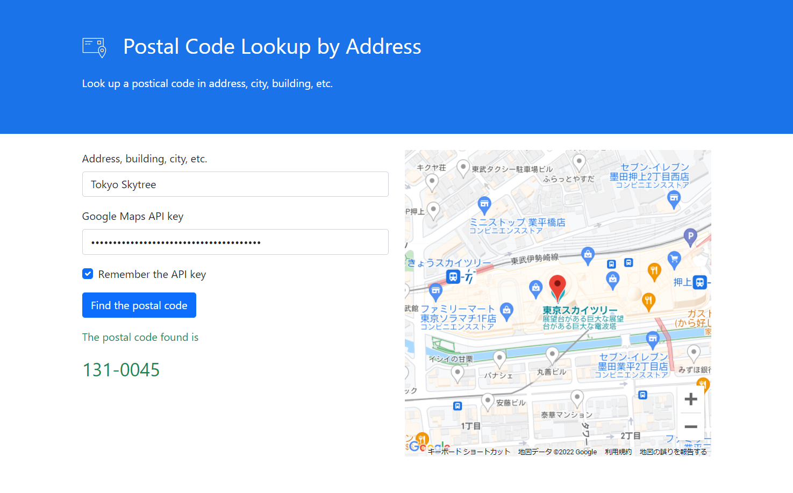

# google-maps-api-example

Example of using Google Maps API in Node.js, browser, etc.

## Installation
```sh
npm install google-maps-api-example;
```

## Online demo
Click [here](https://takuya-motoshima.github.io/google-maps-api-example/) for an online demo.



## Node.js usage
### Postal Code Lookup by Address.
You can find the zip code using the cli/postalCodeLookup.js command line.

Command help.
```sh
node cli/postalCodeLookup.js --help
# Usage: postalCodeLookup [options]
# 
# Postal Code Lookup by Address
# 
# Options:
#   --address <string>  Address you want to find the postcode
#   --key <string>      Google Maps API Key
#   -h, --help          display help for command
```

Find the Tokyo Skytree postal code.
```sh
node cli/postalCodeLookup.js --key YOUR_API_KEY --address "Tokyo Skytree"
# Postal code 131-0045 found
```

You can use different languages for your address.  
For example, find a postal code at a Japanese address
```sh
node cli/postalCodeLookup.js --key YOUR_API_KEY --address "東京スカイツリー"
# Postal code 131-0045 found
```

## Author

**Takuya Motoshima**  
* [github/takuya-motoshima](https://github.com/takuya-motoshima)
* [twitter/TakuyaMotoshima](https://twitter.com/TakuyaMotoshima)
* [facebook/takuya.motoshima.7](https://www.facebook.com/takuya.motoshima.7)

## License
[MIT](LICENSE)